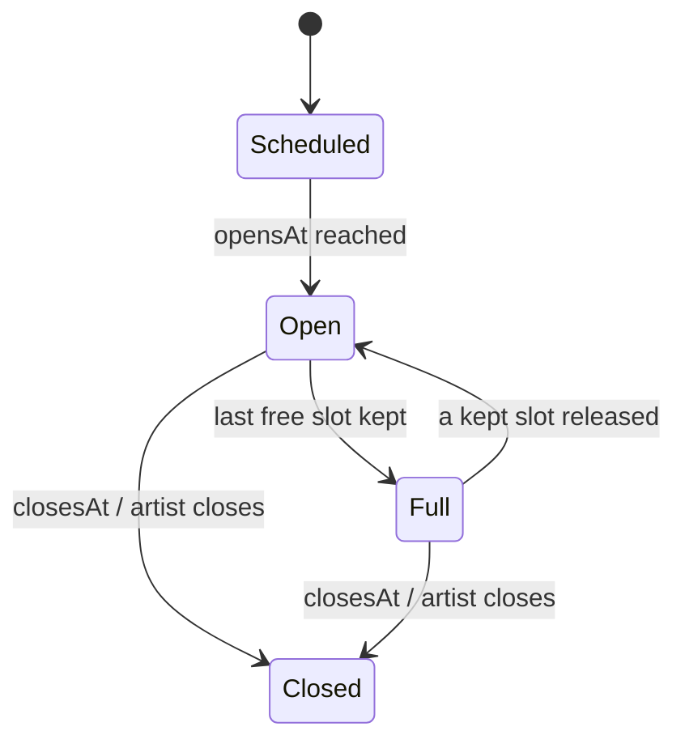
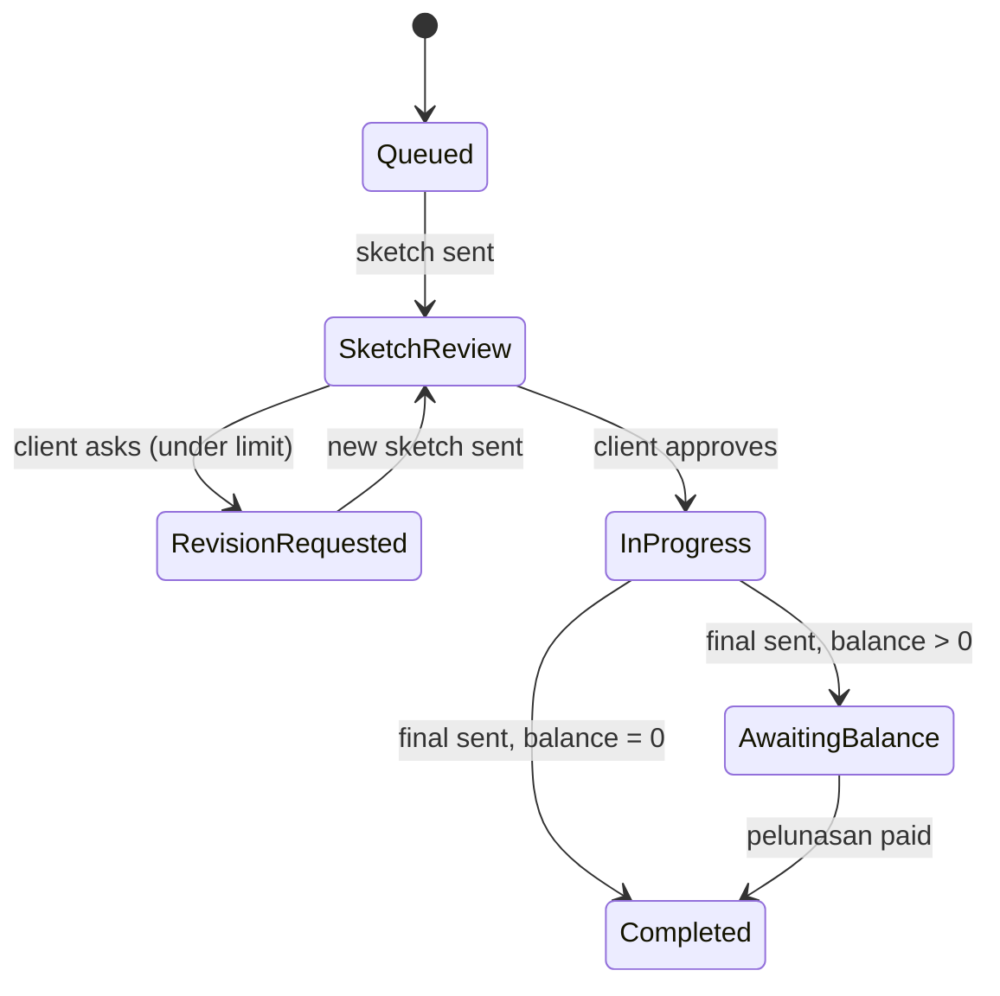

# 2. The domain: aggregates

An aggregate is one thing with a lifecycle plus the rules that protect it. Every change goes **through** it.
There are five cards here; the minimum is four. **CommissionWindow carries the hard rule.**

---

## CommissionWindow ("open comm")

```
Aggregate:  CommissionWindow
Context:    Booking
Identity:   WindowId (opaque, issued by Booking)
Contains:   Slots (free | kept | taken), a snapshot of the pricelist the window opened with
States:     Scheduled --> Open <--> Full --> Closed
                          Open --> Closed        (artist closes early, or closesAt passes)
Rules:      - HARD RULE: kept + taken slots never exceed slotCount, under any concurrency
            - A slot can be kept only while the window is Open (opensAt <= now < closesAt)
            - One client keeps or takes at most one slot per window
            - slotCount may be raised while Open or Full, never lowered below kept + taken
            - A window keeps the pricelist it opened with, even if the artist publishes a new one
Hides:      how slots are locked (conditional update / row lock), whether slots are rows or a counter,
            the pricelist snapshot format
```



## CommissionRequest ("request" / "form")

```
Aggregate:  CommissionRequest
Context:    Booking
Identity:   RequestId (opaque, issued by Booking)
States:     Submitted --> Accepted --> Booked
            Submitted --> Declined
            Accepted  --> Expired
Rules:      - Created only together with a kept slot in the same transaction; no slot, no request
            - The quote is never below the list price (tier start-from + add-ons at the window's pricelist)
            - DP = quote x depositPercent, rounded up to the nearest Rp1.000
            - Accepted but unpaid by payBy --> Expired, and the slot is released
              (only after Payments confirms the DP invoice is void, never while a payment might land)
            - Booked exactly once, even when the payment notification arrives twice
            - Terms (revisionLimit, depositPercent) are frozen at request time
Hides:      TOS review notes, the expiry sweep job, the deposit rounding rule
```

## Pricelist ("PL")

```
Aggregate:  Pricelist
Context:    Pricelist (module inside the booking service)
Identity:   ArtistId + version (version is internal)
States:     Published --> Superseded
Rules:      - A published version never changes; any edit publishes a new version
            - An artist has exactly one current version
            - Every tier has a start-from price > 0; depositPercent is 1..100; revisionLimit >= 0
Hides:      version numbering, how old versions are stored
```

## Invoice ("tagihan")

```
Aggregate:  Invoice
Context:    Payments
Identity:   InvoiceId (opaque, issued by Payments); unique per (reference, purpose)
States:     Issued --> Paid
            Issued --> Void
Rules:      - A settlement is applied exactly once: the same provider reference seen again changes nothing
            - Paid and Void are exclusive: when payment and void race, whichever commits first wins
              and the other gets a conflict
            - The settled amount must equal the invoice amount
            - Creating the same (reference, purpose) again returns the existing invoice (safe retries)
            - InvoicePaid is delivered to notifyUrl at least once (retried on errors and 5xx)
Hides:      which payment provider, callback signature checks, the settlement log, the notification outbox
```

## Commission ("comm", in the Studio sense)

```
Aggregate:  Commission
Context:    Studio
Identity:   CommissionId (opaque, issued by Studio); unique per bookingRef
States:     Queued --> SketchReview <--> RevisionRequested
            SketchReview --> InProgress --> AwaitingBalance --> Completed
            InProgress --> Completed          (when nothing is left to pay)
Rules:      - Exists only for a booked request; the same booking never creates two commissions
            - Revisions requested never exceed the revisionLimit agreed at booking
            - A final can be sent only after the client approved a sketch
            - The hi-res link is never shown to the client while balanceDue > 0
            - balanceDue = quote - paid, both received from Booking (Studio knows no DP policy)
Hides:      internal stages (lineart, coloring) that show outside only as InProgress,
            where links and revision notes are stored, how the queue is ordered
```


