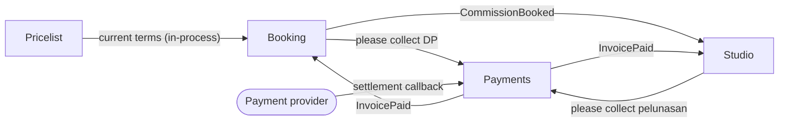

# 2. The domain: bounded contexts

There are four contexts, and each aggregate belongs to exactly one of them. The names are business activities from the glossary, not tables.

| Context | Aggregates | What it hides | The smallest thing it shows |
|---|---|---|---|
| **Booking**: who gets a slot in this round | CommissionWindow, CommissionRequest | Slot locking, the expiry sweep, TOS review notes, deposit rounding | `slotsLeft`; a request's status, quote, DP amount, and `payBy`; the **CommissionBooked** fact sent to Studio |
| **Pricelist**: what the artist charges and on what terms | Pricelist | Versioning, storage of old versions | The current tiers, add-ons, DP percentage, and free revisions (read by Booking only) |
| **Payments**: collecting money exactly once | Invoice | The provider, signatures, settlement log, notification retries | An invoice's status and amount; the **InvoicePaid** fact sent to whoever asked for the invoice |
| **Studio**: making the artwork and handing it over | Commission | Internal stages, file storage, revision notes, queue ordering | A commission's public status, revision count, balance due, and the file link once it has been paid |

## Why these are the boundaries

- **The word changes meaning at each gap.** A *comm* is a claim on a slot in Booking and a drawing in progress in the Studio.
  A *price* is a start-from figure in the Pricelist, a quote in Booking, and an amount due in Payments (see [2-glossary.md](2-glossary.md)).
- **The activities happen at different times and with different people.** Booking is a burst at announcement time between the artist and
  many strangers. The Studio is weeks of back-and-forth between the artist and one client. Payments talks to an external provider.
- **The language changes too.** Booking says *keep, full, ghosting, deadline*. The Studio says *sketch, revisi, WIP, final*.
  Payments says *tagihan, settled, void*.

## Quick check: are these tables in disguise?

No context is named after an entity table (no `UserContext`, `ArtworkContext`, or `OrderContext`). *Booking* is what the artist does
when comms open. *Studio* is where the drawing happens. A **Commission** appears as a different model in two contexts
(CommissionRequest in Booking, Commission in the Studio) because the business means two different things by it.

## Context map

Payments is a **generic service**. It only ever sees `reference`, `purpose`, and `amountIDR`, and it hands the
reference back unread, so both Booking and the Studio can use it without Payments knowing what a slot or a sketch is.
