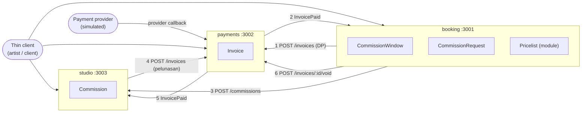

# 3. The boundaries

## 3.1 Which contexts become services

| Context | Now | Why |
|---|---|---|
| Booking | **service `booking`** | It carries the hard rule and takes the announcement-time spike. It will be scaled and hardened on its own later. |
| Payments | **service `payments`** | It talks to an external provider, needs exactly-once handling, and is reused by Booking and the Studio. |
| Studio | **service `studio`** | A different rhythm (weeks, one client) and a different language; the long-running work lives here. |
| Pricelist | **module inside `booking`** | Only Booking reads it, it changes once a round, and making it a service would be a 4th service (limit B1). Split it out if a public artist page ever needs it. Rule for the module: Booking code calls the Pricelist module's functions and never queries its tables. |

We started coarse: three services for four contexts, and one owner per service.

Each service has the three properties from Chapter 1:

| Property | booking | payments | studio |
|---|---|---|---|
| Independently deployable | Restart it, and payments keeps retrying notifications while studio keeps serving | Restart it, and booking and studio keep serving reads | Restart it, and bookings wait in payments' retry loop |
| Modeled around the business | "Booking" is in the glossary | "Payments / tagihan" | "Studio" (sketch, revisi, final) |
| Owns its state | `booking_db` + `booking_user` | `payments_db` + `payments_user` | `studio_db` + `studio_user` |

## Diagram: services, aggregates, and every call



## 3.2 Coupling

| # | Caller | Callee | What is sent | Type | Why it's fine |
|---|---|---|---|---|---|
| 1 | booking | payments | `POST /invoices {reference: requestId, purpose: "dp", payerId, payeeId, amountIDR, dueAt, notifyUrl}` | Domain | Booking needs a DP collected, and collecting money is Payments' job. |
| 2 | payments | booking | `InvoicePaid {invoiceId, reference, purpose, amountIDR, paidAt}` → notifyUrl | Domain | Only a confirmed payment may turn a kept slot into a taken one. Payments echoes the reference without reading it. |
| 3 | booking | studio | `POST /commissions {bookingRef, artistId, clientId, tier, addOns, brief, referenceLinks, quoteIDR, paidIDR, revisionLimit}` | Domain | The studio can't start without the brief and the agreed terms, and Booking is the one that agreed them. |
| 4 | studio | payments | `POST /invoices {reference: commissionId, purpose: "pelunasan", payerId, payeeId, amountIDR, notifyUrl}` | Domain | The Studio is the one that knows the final is ready and how much is still owed. |
| 5 | payments | studio | `InvoicePaid {invoiceId, reference, purpose, amountIDR, paidAt}` → notifyUrl | Domain | Only a confirmed pelunasan may release the hi-res link. |
| 6 | booking | payments | `POST /invoices/{invoiceId}/void` → 200 Void \| 409 AlreadyPaid | Domain | Resolves the race between a late payment and an expiring slot. Payments decides which one won, so a slot is never released after its DP arrived. |

Client calls (thin client → each service) are listed in [/contracts](../contracts/).

### Bad couplings in our first draft, and how we fixed them

**Fix 1: Pass-through coupling (Booking → Payments → Studio)**

*Before.* In our first draft Payments started the studio work once the DP was paid, so it had to carry everything the studio needed:

```
booking  → payments  POST /invoices   {amountIDR, reference, artistId, clientId, tier, addOns, brief, referenceLinks}
payments → studio    POST /commissions {artistId, clientId, tier, addOns, brief, referenceLinks}   (on DP paid)
```

Payments never used `tier`, `brief`, or `referenceLinks`; it only forwarded them. When the Studio wants one more field
(say, `characterCount`), Booking **and** Payments both have to change.

*After.* Payments reports back only to whoever asked. Booking, which owns the brief, tells the Studio itself:

```
booking  → payments  POST /invoices    {reference, purpose, payerId, payeeId, amountIDR, dueAt, notifyUrl}
payments → booking   InvoicePaid       {invoiceId, reference, purpose, amountIDR, paidAt}
booking  → studio    POST /commissions {bookingRef, brief, tier, addOns, referenceLinks, quoteIDR, paidIDR, revisionLimit}
```

Now a new Studio field touches Booking and the Studio only. Payments hasn't changed for a Studio need since.

**Fix 2: Common coupling (shared deposit setting)**

*Before.* The Studio computed pelunasan as `quote × (100 − DEPOSIT_PERCENT) / 100`, reading `DEPOSIT_PERCENT=50` from a shared
`.env` that Booking also read. When an artist switches to a 30% DP, both services must change and be released together, or
the Studio bills the wrong amount.

*After.* Booking sends facts, not policy: `quoteIDR` and `paidIDR`. The Studio computes `balanceDue = quoteIDR − paidIDR`
and knows nothing about DP percentages. The setting now lives only in the Pricelist, inside `booking`.

## 3.3 Cohesion: the cost-of-change test

| Change someone will really ask for | Services that change | Released together? |
|---|---|---|
| **"Let me choose DP 30%, 50%, or full payment up front."** | `booking` only (Pricelist + deposit calculation). Studio already bills `quote − paid`, and at 100% the balance is 0 and there's no pelunasan invoice. Payments invoices any amount. | No |
| **"When a kept slot frees up, offer it to the next person instead of reopening it."** (waitlist) | `booking` only. Slot release and who gets the slot are both inside CommissionWindow. | No |
| **"Charge Rp25.000 for each revision past the free ones."** | `booking` adds optional `extraRevisionFeeIDR` to the Pricelist and to CommissionBooked. `studio` charges it through `POST /invoices` with `purpose: "revisi"`. `payments` doesn't change, because `purpose` is opaque to it. | **No.** Booking ships first (the Studio ignores the unknown field); the Studio ships when ready. |

Two of the three changes touch one service. The third touches two services, but they deploy independently in a known order.
We keep these boundaries. **The warning sign to watch for:** if the artist confirms that "a slot is only theirs once the DP
arrives", slot logic and payment logic would change together every time, and we'd have to reconsider merging DP handling into Booking.

## 3.4 Contracts and information hiding

The contracts are in [/contracts](../contracts/), written and committed before the code. Each contract's service card
lists what it hides. Summary:

| Service | Three decisions the contract does not reveal | Which internal change would break consumers, and what stops it |
|---|---|---|
| booking | (1) how the hard rule is enforced: a conditional update vs. per-slot row locks; (2) slots stored as rows or a counter, and the pricelist snapshot format; (3) id scheme and the expiry sweep interval | Renaming or removing a public `status` value (e.g. `ACCEPTED`) would break clients and tests. The change policy stops it: statuses are add-only in v1, and removals need a `/v2` path. |
| payments | (1) which provider (simulated now, Midtrans or Xendit later) and how signatures are checked; (2) exactly-once via a unique provider reference in the settlement log; (3) the notification outbox and retry schedule | No longer echoing `reference` in InvoicePaid would break both Booking and the Studio, which match on it. The contract marks `reference` as required and returned unchanged in v1. |
| studio | (1) internal stages (lineart, coloring) collapsed into `IN_PROGRESS`; (2) where links and revision notes are stored; (3) queue ordering and the revision counter | Making a new field required in `POST /commissions` would break Booking's calls. The change policy stops it: new request fields must be optional with a default. |
