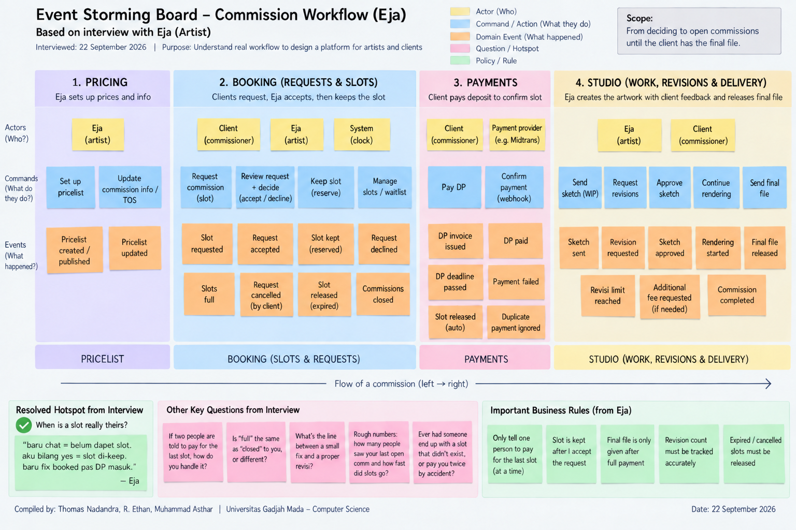

# OpenComm — slot booking for art commissions

**Assignment 1: From App Idea to Services** · Scalable Software Engineering · Universitas Gadjah Mada, Ganjil 2026/2027

**Team OpenComm**

| Name | Student number | Owns | Reviews |
|---|---|---|---|
| Thomas Nadandra Aryawida | 24/536628/PA/22760 | `booking` | `payments` |
| Ryan Ethan Halim | 24/536718/PA/22765 | `payments` | `studio` |
| Muhammad Asthar Bin Rizwan | 24/546649/PA/23208 | `studio` | `booking` |

**Repository:** `https://github.com/Troggz/Scalable---Group-Assignment`
**Screencast (3 min):** `https://drive.google.com/file/d/1Ei79xbOzDo6RHNZPmJ9lYVKdgLhkphci/view`
(also in the repository root as `Screencast Video Explanation.mp4`)

**The app.** Independent illustrators take commissions in rounds called *open comm*. OpenComm is the booking desk for
one round, and it never oversells the artist's slots.

---

# 1 The app

Independent illustrators take paid commissions in rounds. An artist announces a window — *October, 5 slots* — and
clients request those slots. Most artists run this with a Google Form, DMs and a spreadsheet, and that setup breaks at
the worst moment: when a post goes out, far more people reply than there are slots, most within the hour. The artist
ends up with more takers than slots, apologises and refunds, then spends the month tracking who paid the DP, which
sketch is waiting on approval, and who still owes *pelunasan*. OpenComm gives each artist a page for their window that
never oversells, and tracks every commission from request to final file.

**Users.** The **artist** publishes a pricelist and terms, opens windows, accepts or declines requests, and delivers
sketch and final; they care about never being overbooked, holding the DP before starting, and capped revisions. The
**client** requests a slot with a brief, pays DP and pelunasan, approves the sketch and downloads the final; they care
about a fair chance at a slot, a known price up front, and seeing where their commission stands. The payment provider
is an external system, not a user.

**Features (10).** Artist publishes a pricelist (tiers, add-ons, DP percentage, free revisions); artist opens a window
with a slot count and open/close times; anyone can see a window and how many slots are left; a client sends a request
with brief and references (one live request per client per window, no slot held); the artist accepts with a quote at
or above the start-from price, or declines — accepting keeps a slot; the client pays the DP, and an unpaid DP past the
deadline frees the slot; the artist sends a sketch and the client approves or requests a revision up to the agreed
limit; the artist sends the final as a preview link plus a hi-res link; the client pays pelunasan and the hi-res link
is released; the artist sees their queue and each client sees their commission's status.

**Deliberately left out:** discovery, search, ratings · chat · login and accounts · refunds, disputes, escrow · a
waitlist · paid extra revisions · image upload and watermarking (we store links) · a real payment gateway (simulated)
· notifications · a mobile app.

**Main flow.** Artist *rara* publishes a pricelist (half body from Rp250.000, +background Rp50.000, DP 50%, two free
revisions) and opens *October comms* with **3 slots**. Clients send requests — a request holds nothing. Rara reviews
one against her TOS and **accepts** it with a quote of Rp350.000; accepting **keeps** a slot and issues a DP invoice
for Rp175.000, due in 1×24 hours. When every slot is kept or taken, the next accept is refused with *slots full*. The
client pays, the provider confirms, the slot becomes **taken**, and the commission joins Rara's queue. Rara sends a
sketch; the client asks for one revision, then approves. Rara sends the final preview and a pelunasan invoice for
Rp175.000. The client pays, the hi-res link is released, and the commission is **completed**.

**Hard rule.** *An artist never gets more commissions in a window than the slots they opened, however many clients are
competing for the last one.* Related: a payment is applied exactly once, even if the provider's callback arrives twice.

**Load.** Load arrives in spikes. Eja, the artist we interviewed, reaches about a thousand people with one post; his
last five-slot round drew fifteen to twenty serious enquiries and filled inside thirty to sixty minutes. He has
already had two clients arrive together for the last slot, and handles it today by telling one to wait. A second,
smaller burst follows as accepted clients pay their DP and the provider sends callbacks, sometimes more than once.

**Not a marketplace (R4).** No discovery, search, ranking, reviews, chat, escrow or disputes. Each artist shares a link
to their own window. More artists means more tenants, not a catalogue. We process no images — sketches and finals are
links.

---

# 2 The domain

We interviewed **Eja**, an illustrator who runs open comms in batches of about five slots, on 22 September 2026, and
ran a 90-minute event-storming session with him the same day. The board export is in `screenshots/`.

## 2.1 Ubiquitous language

Thirteen terms in his words; the full glossary is in `docs/2-glossary.md`.

| Term | How he said it | Context |
|---|---|---|
| **baru chat / ngechat** | *"pas orang baru ngechat atau nanya itu belum aku anggap dapet slot"* | Booking (boundary) |
| **di-keep** | *"slot sementara ditahan setelah artist accept"* | Booking |
| **DP masuk** | *"deposit sudah diterima"* | Payments |
| **full** | *"semua slot yang aku buka udah keisi / lagi di-keep orang"* | Booking |
| **closed** | *"aku memang udah ga nerima request lagi"* | Booking |
| **release slot** | *"slot yang tadinya di-keep dibuka lagi"* | Booking |
| **revisi** | *"yang ngubah gambar lumayan banyak"* | Studio |
| **antrean** | *"urutan commission yang sudah booked"* | Studio |

Also *brief*, *fix booked*, *fix*, *comm* and *waitlist*. **baru chat** is the most load-bearing: it names the stage
where someone has messaged and has nothing, and it is why the hard rule fires at accept rather than at request.

**Two terms that change meaning across the business.** **"fix"** means *settled* in Booking — *"DP masuk = fix
booked"* — and *a small correction* in the Studio — *"kalau cuma hal kecil … biasanya aku anggap fix aja"*. Two
unrelated meanings, one word, and nobody outside the artist's head would guess they were the same. **"comm"** is a
claim on one slot with a price in Booking (*"buka comm"*, *"close comm"*), counted against the window; in the Studio
it is one piece of artwork moving sketch → revisions → final (*"aku accept commnya"*), with a brief, a revision count
and file links. Booking passes the Studio one fact — this one is booked, here are the terms — and never hears about
sketches. That gap is the service boundary.

## 2.2 Event storming



The session produced **24 domain events** in four columns, typed up in full in `docs/2-board.md`. Abridged:

> Pricelist created/published · Pricelist updated · **Slot requested** · **Request accepted** · **Slot kept
> (reserved)** · Request declined · **Slots full** · Request cancelled (by client) · Slot released (expired) ·
> Commissions closed · DP invoice issued · **DP paid** · DP deadline passed · Payment failed · Slot released (auto) ·
> **Duplicate payment ignored** · Sketch sent · Revision requested · Sketch approved · Rendering started · Revisi
> limit reached · Additional fee requested · **Final file released** · Commission completed

Actors: artist · client · clock · payment provider. The four columns the events sorted into were Pricelist, Booking,
Payments and Studio — the same four bounded contexts we had drawn beforehand, arrived at independently.

**The hotspot, resolved on the board.** *When is a slot really theirs?*

> *"baru chat = belum dapet slot. aku bilang yes = slot di-keep. baru fix booked pas DP masuk."* — Eja

Three distinct moments, and the middle one consumes capacity. He was also explicit that it is **not** first-to-pay:
*"bukan siapa yang transfer paling cepet"*. He keeps the slot for whoever he accepted first, because telling two
people to pay creates a problem he then has to clean up.

## 2.3 Aggregates

Five cards; `docs/2-aggregates.md` has them in full. **CommissionWindow carries the hard rule.**

```
Aggregate:  CommissionWindow                       Context: Booking
Identity:   WindowId (opaque, issued by Booking)
Contains:   Slots (free | kept | taken), a snapshot of the pricelist the window opened with
States:     Scheduled --> Open <--> Full --> Closed;  Open --> Closed (artist closes early)
Rules:      - HARD RULE: kept + taken never exceed slotCount, under any concurrency
            - A slot can be kept only while the window is Open
            - One client keeps or takes at most one slot per window
            - slotCount may be raised while Open, never lowered below kept + taken
            - A window keeps the pricelist it opened with
Hides:      how slots are locked, whether slots are rows or a counter, the snapshot format
```

| Aggregate | Context | States | A rule that matters |
|---|---|---|---|
| **CommissionRequest** | Booking | Submitted → Accepted → Booked; → Declined; Accepted → Expired | Accepted but unpaid by `payBy` expires **only after** Payments confirms the invoice is void |
| **Pricelist** | Pricelist | Published → Superseded | A published version never changes; an edit publishes a new one |
| **Invoice** | Payments | Issued → Paid; Issued → Void | A settlement applies exactly once; Paid and Void are exclusive |
| **Commission** | Studio | Queued → SketchReview ↔ RevisionRequested → InProgress → AwaitingBalance → Completed | The hi-res link is never shown while `balanceDue > 0` |

## 2.4 Bounded contexts

| Context | Aggregates | What it hides | Smallest thing it shows |
|---|---|---|---|
| **Booking** — who gets a slot this round | CommissionWindow, CommissionRequest | Slot locking, the expiry sweep, deposit rounding | `slotsLeft`; a request's status, quote, DP and `payBy`; **CommissionBooked** |
| **Pricelist** — what the artist charges | Pricelist | Versioning, old-version storage | Current tiers, add-ons, DP %, free revisions (Booking only) |
| **Payments** — collecting money exactly once | Invoice | The provider, signatures, settlement log, retries | An invoice's status and amount; **InvoicePaid** |
| **Studio** — making and handing over the artwork | Commission | Internal stages, file storage, queue ordering | Status, revision count, balance due, the link once paid |

None is named after a table. The language changes at every gap: Booking says *keep, full, deadline*; the Studio says
*sketch, revisi, final*; Payments says *tagihan, settled, void*.

---

# 3 The boundaries

## 3.1 Which contexts become services

Three services for four contexts, one owner each. **Pricelist stays a module inside `booking`**: only Booking reads it,
it changes once a round, and promoting it would be a fourth service. Booking calls the module's functions and never
queries its tables.

| Property (Ch. 1) | booking | payments | studio |
|---|---|---|---|
| Independently deployable | Restart it; payments keeps retrying and studio keeps serving | Restart it; the others keep serving | Restart it; bookings wait in payments' retry loop |
| Modeled around the business | "Booking" is in the glossary | "Payments / tagihan" | "Studio" (sketch, revisi, final) |
| Owns its state | `booking_db` + `booking_user` | `payments_db` + `payments_user` | `studio_db` + `studio_user` |

```
   thin client ──▶ booking :3001        payments :3002        studio :3003
                   ├ CommissionWindow   └ Invoice             └ Commission
                   ├ CommissionRequest
                   └ Pricelist (module)

   1  booking  ──▶ payments   POST /invoices (dp)        4  studio   ──▶ payments  POST /invoices (pelunasan)
   2  payments ──▶ booking    InvoicePaid                5  payments ──▶ studio    InvoicePaid
   3  booking  ──▶ studio     POST /commissions          6  booking  ──▶ payments  POST /invoices/{id}/void
                                                            provider ──▶ payments  settlement callback
```

## 3.2 Coupling

| # | Caller | Callee | What is sent | Type | Why it is fine |
|---|---|---|---|---|---|
| 1 | booking | payments | `POST /invoices {reference, purpose:"dp", payerId, payeeId, amountIDR, dueAt, notifyUrl}` | Domain | Booking needs a DP collected; collecting money is Payments' job |
| 2 | payments | booking | `InvoicePaid {invoiceId, reference, purpose, amountIDR, paidAt}` | Domain | Only a confirmed payment turns a kept slot into a taken one; Payments echoes the reference without reading it |
| 3 | booking | studio | `POST /commissions {bookingRef, artistId, clientId, tier, addOns, brief, referenceLinks, quoteIDR, paidIDR, revisionLimit}` | Domain | The Studio cannot start without the brief and terms, and Booking agreed them |
| 4 | studio | payments | `POST /invoices {reference, purpose:"pelunasan", …}` | Domain | The Studio knows the final is ready and how much is owed |
| 5 | payments | studio | `InvoicePaid {…}` | Domain | Only a confirmed pelunasan releases the hi-res link |
| 6 | booking | payments | `POST /invoices/{id}/void` → 200 \| 409 `AlreadyPaid` | Domain | Resolves the race between a late payment and an expiring slot; Payments decides who won |

All six are Domain coupling. No service must call more than one other before it can answer.

**Bad coupling 1: pass-through.** *Before*, Payments started the studio work once the DP was paid, so Booking sent it
`tier`, `brief` and `referenceLinks` — none of which Payments used. It only forwarded them, so a new Studio field
would have forced edits in Booking **and** Payments.

```
before:  booking → payments  POST /invoices {amountIDR, reference, tier, brief, referenceLinks, …}
         payments → studio   POST /commissions {tier, brief, referenceLinks, …}
after:   booking → payments  POST /invoices {reference, purpose, payerId, payeeId, amountIDR, dueAt, notifyUrl}
         payments → booking  InvoicePaid {invoiceId, reference, purpose, amountIDR, paidAt}
         booking → studio    POST /commissions {bookingRef, brief, tier, addOns, quoteIDR, paidIDR, …}
```

Payments now reports back only to whoever asked, and Booking — which owns the brief — tells the Studio itself.

**Bad coupling 2: common coupling.** *Before*, the Studio computed pelunasan as `quote × (100 − DEPOSIT_PERCENT)/100`,
reading `DEPOSIT_PERCENT=50` from a shared `.env` that Booking also read. Switching an artist to a 30% DP would force
both services to change and release together, or the Studio bills the wrong amount. *After*, Booking sends facts, not
policy — `quoteIDR` and `paidIDR` — and the Studio computes `balanceDue = quoteIDR − paidIDR`, knowing nothing about
DP percentages. The setting lives only in the Pricelist, inside `booking`.

## 3.3 Cost-of-change test

| Change someone will really ask for | Services that change | Released together? |
|---|---|---|
| "Let me offer DP 30%, 50%, or full payment up front." | `booking` only. The Studio already bills `quote − paid`; at 100% the balance is 0 | No |
| "When a kept slot frees up, offer it to the next person." | `booking` only. Release and allocation both live in CommissionWindow | No |
| "Charge Rp25.000 per revision past the free ones." | `booking` adds a Pricelist field; `studio` charges it via `POST /invoices` with `purpose:"revisi"`. Payments does not change — `purpose` is opaque to it | **No.** Booking ships first; the Studio ignores the unknown field until ready |

## 3.4 What each service hides

| Service | Three decisions the contract does not reveal | What would break consumers, and what stops it |
|---|---|---|
| booking | How the hard rule is enforced; whether slots are rows or a counter; the id scheme and sweep interval | Renaming a public status (`ACCEPTED`) breaks clients. Statuses are add-only in v1; removals need `/v2` |
| payments | Which provider and how signatures are checked; exactly-once via a unique provider reference; the notification outbox | Not echoing `reference` in InvoicePaid breaks Booking and the Studio. The contract marks it required and returned unchanged |
| studio | Internal stages collapsed into `IN_PROGRESS`; where links and notes are stored; queue ordering | A new required field in `POST /commissions` breaks Booking. New request fields must be optional with a default |

Contracts are three OpenAPI 3.1 files in `/contracts`, committed while `/services` held only READMEs.

---

# 4 The build

**What runs: all of it.** Three Node.js services, one PostgreSQL database and login role each, plus a thin client in
`/client`. The whole main flow crosses all three services and passes end to end.

| Evidence | Result |
|---|---|
| Main flow, steps 0–15, asserted (`client/flow.mjs`) | **28 passed, 0 failed** |
| Hard rule under load: 20 parallel accepts on 3 slots | **exactly 3 × 200, 17 × 409 `SlotsFull`**, 95 ms |
| Exactly-once: identical provider callback twice | `applied: true`, then `applied: false` |
| DP deadline releases a kept slot (`client/expiry.mjs`) | request `EXPIRED`, slot returned, invoice `VOID` |
| Data ownership, B2 (`infra/db/verify-isolation.sh`) | **9/9** — every cross-service connection refused |
| Change one service, restart alone, B4 | booking `uptimeSeconds` 29 → **31** (reset); payments 22 → **324**, studio 14 → **317** |
| Clean clone: fresh `git clone`, README followed as written | 28/28 |

Screenshots for each are in `screenshots/`. The B4 evidence is a number rather than an assertion: a redeploy would
have put payments and studio back near zero. They kept counting, so they were never touched while booking changed and
restarted.

**The hard rule is one conditional `UPDATE`**, never read-then-write:

```sql
UPDATE commission_windows SET kept = kept + 1
 WHERE id = $1 AND kept + taken < slot_count AND NOT closed_early AND now() < closes_at
RETURNING id;               -- 0 rows → 409 SlotsFull
```

A read-then-write version passes a single-user demo and loses slots the moment two accepts land together. A database
`CHECK (kept + taken <= slot_count)` backs it up, but a demo that passed because the *database* refused the oversell
would still be a failure: the `UPDATE` must not match a row in the first place.

**Resilience.** With `studio` stopped, booking still takes requests and accepts, and payments still settles. Booking
commits the booking, fails to hand off, and answers **503**; payments retried six times and the commission landed on
its own when studio came back. Nothing was lost and nothing was double-counted.

**What does not run.** Three events from the board have nothing behind them: **request cancelled by the client**,
**payment failed** (the callback accepts only `SETTLED`), and **additional fee requested** at the revision limit.
There is no authentication, no real gateway and no waitlist — deliberate exclusions, unlike the three above, which are
genuine gaps found after the code was written (§5.c). Revision counting is built but cannot be automatic: Eja
classifies a change by how much must be redrawn, not by message count, so the artist decides what increments it.

---

# 5 Reflection

**5.a Which cost from Chapter 1 hit us first.** **The loss of the transaction across a boundary**, in the first full
integration run on 22 September 2026. Eja's answer to the hotspot — the slot is kept at *accept* — was implemented
correctly in `accept()`, but its consequence was not followed through: if only the DP deadline can release a kept
slot, something must do the releasing, and nothing did. A client who accepted and went quiet held a slot forever. Our
demo script still described the *old* model, where declining an accepted request freed the slot, so the gap hid behind
a stale document until the services ran together. The fix was cheap in a monolith and expensive here. Two services
each hold part of the truth about one slot: Booking knows the deadline passed, Payments knows whether money arrived.
In one process that is a transaction; across a boundary it is a protocol, and the ordering is the whole design —
**void the invoice first, release the slot second**. The contract makes paid and void exclusive, so a `409
AlreadyPaid` is Payments saying the money arrived after all, and the sweep leaves the slot alone. Release first and
you hand away a slot someone had just paid for. About forty minutes to find and build, and it needed a rule about
*who decides*, not a line of code.

**5.b Would a modular monolith have been better?** **Yes — for this app, at this size, we would ship a monolith in a
real project.** We split it here to learn. The argument is not close: three of us, one deployment target. The hard
rule, the part that actually matters, is a single conditional `UPDATE` inside one database and would be identical in a
monolith. Almost everything else we built exists *because* of the split — the retry loop in Payments' notification
outbox, the 503-and-retry handshake between Booking and the Studio, idempotent receivers on both sides, the settlement
log for exactly-once delivery, and the void-then-release ordering above. In one process, "book the request and queue
the commission" is one transaction that either happens or does not; across two services it is a distributed protocol
we had to design and test. Setup grew from one database to three roles, three databases and three `.env` files. Three
modules in one deployable, with three schemas and no cross-schema queries, would keep every boundary we drew — the
contracts are the module interfaces — at a fraction of the cost. **What would make us split:** load, since the
announcement spike is entirely Booking's and may need to scale independently of a Studio doing week-long work; release
rhythm, if Studio features shipped daily while Booking's slot logic had to stay frozen during an open round; and team
size, since one-owner-per-service works at three people but past roughly two teams, independent deployment stops being
ceremony and becomes the only way to ship without queueing.

**5.c What event storming changed about our design.** Honestly: the interview drove the design, but our board session
ran *after* the code was working. The handout puts it before, and that is the right order — we ran the session knowing
its remaining value was whether it could still contradict us. It did, three times, and we recorded those as
contradictions rather than talking them away. **The interview moved the hard rule.** Our draft consumed a slot at
*request* time. Eja was precise that a message is not a slot — *"baru chat = belum dapet slot"* — and that a slot is
kept when he accepts, booked when the DP lands. That moved the conditional `UPDATE` out of the request handler into
`accept()`, made `POST /windows/{id}/requests` impossible to refuse for capacity, and gave `accept` a `409 SlotsFull`
it did not have. It also killed a prepared alternative in which payment consumed the slot first-come; he deliberately
avoids a payment race, *"kalau dua-duanya aku suruh bayar terus dua-duanya transfer malah aku yang bikin masalah
sendiri"*. We kept that dead design in `docs/3-option-b.md` as evidence the domain decided it. **The board found three
things we do not do** — request cancelled by the client, payment failed, and additional fee requested — none of which
appeared in the thirty candidate events we prepared beforehand. Each is a small change to one service, which we take
as a sign the boundaries are drawn in the right places even where behaviour is missing. **One word changed the
design:** *revisi* and *fix* are different to him, and the line is how much must be redrawn, not how many messages
arrive, so the revision counter cannot be automatic. We had modelled an automatic counter and it was wrong. **And the
boundaries held:** the four columns his events sorted into — Pricelist, Booking, Payments, Studio — are exactly the
four contexts we had drawn before the session.
